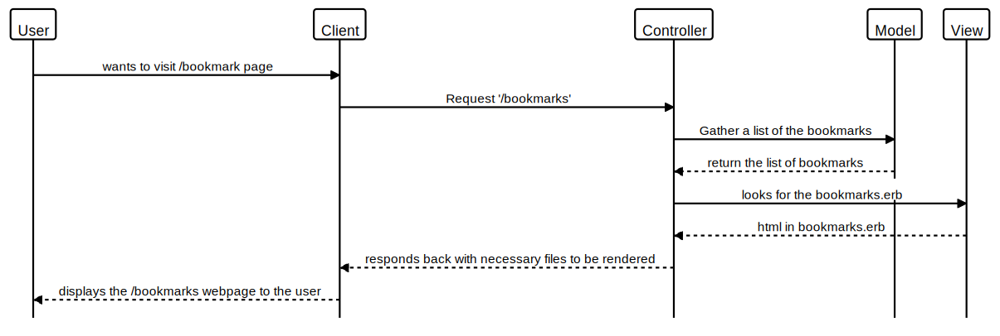

# Bookmarks Manager

User Story:
```
As a user,
So that I can see my bookmarks,
I'd like to see a list of bookmarks containing URLs.
```

```
As a user,
So that i can add bookmarks,
I'd like to be able to add a bookmark.

```

```
As a user,
So that i can delete bookmarks,
I'd like to be able to delete a bookmark.

```

```
As a user,
So that i can change my bookmarks,
I'd' like to be able to update a bookmark.

```


╔════════════╗       .update        ╔════════════╗  UPDATE bookmarks SET title = '#{title}' WHERE title = '#{title}'╔════════════╗
║            ║--------------------->║            ║--------------------------------------------------------->        ║            ║
║ Controller ║ [array of bookmarks] ║  Bookmark  ║                           {result object}                        ║  Database  ║
║            ║<---------------------║            ║<-----------------------------------------------------------------║            ║
╚════════════╝                      ╚════════════╝                                                                  ╚════════════╝



# Setting up Database
1. Connect to psql
2. Create the database using the psql command CREATE DATABASE bookmark_manager;
3. Connect to the database using the pqsl command \c bookmark_manager;
4. Run the query we have saved in the file 01_create_bookmarks_table.sql

# Setting up Test Database
1. Connect to psql
2. Create the database using the psql command CREATE DATABASE bookmark_manager_test;
3. Connect to the database using the pqsl command \c bookmark_manager_test;
4. Run the query we have saved in the file 01_create_bookmarks_table.sql
